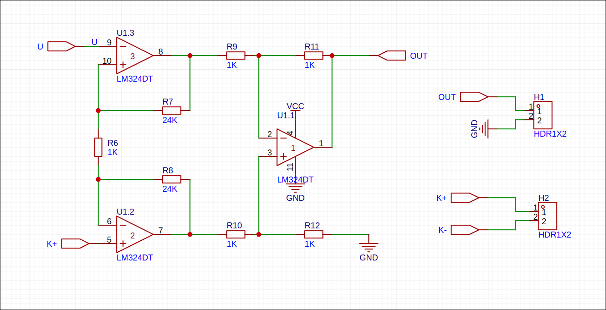

<table font-size="1px">
  <th>学号:</th>
  <th></th>
  <th>姓名:</th>
  <th></th>
  <th>批次</th>
  <th></th>
</table>

# 
非电量检测技术综合预习报告
 

## 一. 实验目的

1. 掌握传感器的静态标定过程和方法。
2. 了解非电量检测系统的组成。
## 二. 实验要求和注意事项
- 传感器只能在实验室使用，不可带走
- 离开加热箱时要断电，不可以把吃的放在加热箱内
- 数据造假实验报告为零分，实验报告类同报告分数为零分。
- 如有以上违反实验室安全的行为，实验分数降档

## 三.实验电路图
### 传感器输入输出关系

||
|:--:|
|信号放大原理图|

为满足实验精度需求我们使用差分放大电路完成信号的放大，公式推导如下:

$$
由虚短可知： \\
V_{9} = V_{10} \\
V_{6} = V_{5} \\
$$

$$
由虚断可知：\\
I = (V_9 - V_5) / R_2 \\
$$

$$
整理得 \\
V_out = I \times (R_1+R_2+R_3)= (V_9 - V_5) \times \frac{ (R_1 + R_2 + R_3)}{R_2} \\
$$

由电路图可知温度变化$1^{\circ} C$时电压变化0.098$v$大于0.002$v$的指标。

||
|:--:|
|冷端补偿电路|

#### 原理
设冷端置于 0℃ 环境下,用热端接触被测物体。假如被物体是开水,温度 100℃ ,那 么热端与冷端之间会产生4.096mⅤ 的电势,依据 K型 热电偶分度表,查表得到 100℃ (测量值与真实值相吻合)。而实际使用时热电偶的冷端是处在随时变化的环境中的,冷 端很难保证 0℃。现在置冷端于 30℃ 环境下 ,把热端同样置开水中,结 果热端与冷端的电势差变为 2.893mⅤ 。查 Κ 型热电偶分度表得到 71℃ ,与 真实值相差了 29℃
#### 补偿电路工作过程
由 于环境温度从0℃上升 到 30℃ 导 致 热 电偶 电 势 下 降 了⒈203mⅤ 。只要给热 电偶正端叠加上⒈203mⅤ (或 负端减去 1.203mⅤ ),最终结果就是正确的。因二极管的温度系数是2mⅤ /℃ ,从 0℃到30℃ 二 极管的端电压变化了60mⅤ ,而热电偶只需 1.203mⅤ的 补 偿 ，60mV/1.203mV≈50倍 ,即把二极管的端电压变化减小到 l/50,方法很简单。电阻分压只要$R_2/(R_2+R_3)=50$即可。

