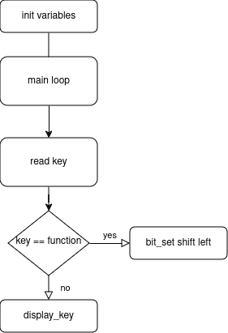

批次/序号： 
<center style="font-size:25px; margin-bottom:10pt; margin-top:10">桂林电子科技大学 电子工程与自动化学院</center>
<center style="font-size:20px">智能仪器实验 预习报告</center>
<table style="margin-top:20pt; margin-bottom:8pt; width:486.2pt; margin-bottom:0pt; border-collapse:collapse">
				<tr style="height:27.4pt">
					<td rowspan="2" style="width:65.35pt; padding-left:4.25pt; vertical-align:bottom">
						<p style="text-indent:0pt; line-height:60%; font-size:12pt">
							<span style="font-family:宋体">实验名称：</span>
						</p>
					</td>
					<td rowspan="2" style="width:86.9pt; border-bottom:0.75pt solid #000000; padding-left:4.25pt; vertical-align:bottom">
						<p style="text-indent:0pt; text-align:center; line-height:60%; font-size:9pt">
							<span style="font-family:宋体">&#xa0;</span>
						</p>
					</td>
					<td rowspan="2" style="width:42.1pt; padding-left:4.25pt; vertical-align:bottom">
						<p style="text-indent:0pt; line-height:60%; font-size:12pt">
							<span style="font-family:宋体">专业：</span>
						</p>
					</td>
					<td rowspan="2" style="width:98.85pt; border-bottom:0.75pt solid #000000; padding-left:4.25pt; vertical-align:bottom">
						<p style="text-indent:0pt; text-align:center; line-height:60%; font-size:12pt">
							<span style="font-family:宋体">&#xa0</span>
						</p>
					</td>
					<td rowspan="2" style="width:7.38pt; border-right:0.75pt solid #000000; padding-left:4.25pt; vertical-align:bottom">
						<p style="text-indent:21pt; line-height:60%; font-size:12pt">
							<span style="font-family:宋体">&#xa0;</span>
						</p>
					</td>
					<td colspan="3" style="width:179.75pt; border-left:0.75pt solid #000000; padding-left:3.88pt; vertical-align:bottom">
						<p style="text-indent:0pt; text-align:left; line-height:60%; font-size:12pt">
							<span style="font-family:宋体">教师评阅意见：</span>
						</p>
					</td>
				</tr>
				<tr >
					<td colspan="3" rowspan="3" style="width:179.75pt; border-left:0.75pt solid #000000; padding-left:3.88pt; vertical-align:top">
						<p style="text-indent:0pt; line-height:40%; font-size:10pt">
							<span style="font-family:宋体">&#xa0;</span>
						</p>
					</td>
				</tr>
				<tr style="height:1pt">
					<td style="width:55.35pt; padding-left:4.25pt; vertical-align:bottom">
						<p style="text-indent:0pt; line-height:60%; font-size:12pt">
							<span style="font-family:宋体">学</span><span style="font-family:宋体">&#xa0;&#xa0;&#xa0; </span><span style="font-family:宋体">号：</span>
						</p>
					</td>
					<td style="width:86.9pt; border-top:0.75pt solid #000000; border-bottom:0.75pt solid #000000; padding-left:4.25pt; vertical-align:bottom">
						<p style="text-indent:0pt; text-align:center; line-height:60%; font-size:12pt">
							<span style="font-family:宋体">&#xa0;</span>
						</p>
					</td>
					<td style="width:42.1pt; padding-left:4.25pt; vertical-align:bottom">
						<p style="text-indent:0pt; line-height:60%; font-size:12pt">
							<span style="font-family:宋体">姓名：</span>
						</p>
					</td>
					<td style="width:98.85pt; border-top:0.75pt solid #000000; border-bottom:0.75pt solid #000000; padding-left:4.25pt; vertical-align:bottom">
						<p style="text-indent:0pt; text-align:center; line-height:60%; font-size:12pt">
							<span style="font-family:宋体">&#xa0;</span>
						</p>
					</td>
					<td style="width:7.38pt; border-right:0.75pt solid #000000; padding-left:4.25pt; vertical-align:top">
						<p style="text-indent:21pt; line-height:60%; font-size:12pt">
							<span style="font-family:宋体">&#xa0;</span>
						</p>
					</td>
				</tr>
				<tr style="height:1pt">
					<td rowspan="2" style="width:65.35pt; padding-left:4.25pt; vertical-align:bottom">
						<p style="text-indent:0pt; line-height:60%; font-size:12pt">
							<span style="font-family:宋体">实验日期：</span>
						</p>
					</td>
					<td rowspan="2" style="width:86.9pt; border-top:0.75pt solid #000000; border-bottom:0.75pt solid #000000; padding-left:4.25pt; vertical-align:bottom">
						<p style="text-indent:0pt; text-align:center; line-height:60%; font-size:12pt">
							<span style="font-family:'Times New Roman'">&#xa0</span>
						</p>
					</td>
					<td colspan="2" rowspan="2" style="width:135.2pt; padding-left:4.25pt; vertical-align:bottom">
						<p style="text-indent:0pt; text-align:left; line-height:60%; font-size:12pt">
							<span style="font-family:宋体">格式规范性得分：</span>
						</p>
					</td>
					<td rowspan="2" style="width:7.38pt; border-right:0.75pt solid #000000; padding-left:4.25pt; vertical-align:top">
						<p style="text-indent:21pt; line-height:60%; font-size:12pt">
							<span style="font-family:宋体">&#xa0;</span>
						</p>
					</td>
				</tr>
				<tr style="height:18.45pt">
					<td style="width:41.5pt; border-left:0.75pt solid #000000; padding-left:3.88pt; vertical-align:bottom">
						<p style="text-indent:0pt; text-align:left; line-height:60%; font-size:12pt">
							<span style="font-family:宋体">成绩：</span>
						</p>
					</td>
					<td style="width:33pt; padding-left:4.25pt; vertical-align:bottom">
						<p style="text-indent:0pt; text-align:center; line-height:60%; font-size:12pt">
							<span style="font-family:宋体">&#xa0;</span>
						</p>
					</td>
					<td style="width:106.75pt; padding-left:4.25pt; vertical-align:bottom">
						<p style="text-indent:0pt; text-align:left; line-height:60%; font-size:12pt">
							<span style="font-family:宋体">教师签名：</span>
						</p>
					</td>
				</tr>
				<!-- <tr style="height:0pt">
 -->
				<!-- 	<td style="width:59.6pt">
 -->
				<!-- 	</td>
 -->
				<!-- 	<td style="width:91.15pt">
 -->
				<!-- 	</td>
 -->
				<!-- 	<td style="width:36.35pt">
 -->
				<!-- 	</td>
 -->
				<!-- 	<td style="width:103.1pt">
 -->
				<!-- 	</td>
 -->
				<!-- 	<td style="width:12pt">
 -->
				<!-- 	</td>
 -->
				<!-- 	<td style="width:35.75pt">
 -->
				<!-- 	</td>
 -->
				<!-- 	<td style="width:37.25pt">
 -->
				<!-- 	</td>
 -->
				<!-- 	<td style="width:111pt">
 -->
				<!-- 	</td>
 -->
				<!-- </tr>
 -->
</table>

# 一、实验原理理解和任务分析（20分，得分： ）

1. 如何使用循环扫描按键
2. 如何通过行列值查找按键的数码表
3. 如何使用位运算似的程序更加具有鲁棒性
4. 如何判断是否是funtion按键
5. 如何如何使用位运算实现指定的位移功能
6. 如何确定delay 函数的位置

# 二、设计思路介绍（25分，得分： ）


1. 使用宏定义区分keil和sdcc编译器的预操作
2. 使用全局变量控制地址和function key
3. 使用位运算得到目标地址
4. 使用函数实现read key和display key实现读取和显示的解耦
5. 使用while循环实现key的循环扫描


# 三、程序流程图介绍（25分，得分： ）
<center>



</center>

# 四、主程序介绍（20分，得分： ）

main function 计算总线地址并启动主循环开始扫描按键并显示
```c
void main()
{
    uint write_bus = cs_key | 0x02;
    uint read_bus = cs_key | 0x01;
    uint display_bus = cs_key | 0x04;
    uint display_bit_bus = cs_key | 0x02;
    while (1)
    {
        /* code */
        uchar key = read_key(read_bus, write_bus);
        if (key == 0) continue;// if no key continue

        uchar row = key & 0x0f;
        uchar col = key >> 4;
        if (key == function_key)
        {
            bit_set = (bit_set << 1);
        }
        uchar display_char = key_tab[row * 4 + col];
        display_key(display_char, display_bus, display_bit_bus, bit_set);
    }
}
```
read_key funtion 控制74h374循环输出0并读取键，如果读到了键将行放在高8位列放在低8位
```c
// sacnning keys from 0xX000 to 0xX008
uchar read_key(uint read_bus, uint write_bus)
{
    uchar xdata *key_bus_pointer;
    uchar i;
    uint key;
    for (i = 0; i < 8; i++)
    {
        // set read bus address
        key_bus_pointer = write_bus | (i * 2);
        // wite 0 to output
        *key_bus_pointer = 0;
        // read form read_buf
        key_bus_pointer = read_bus;
        key = *key_bus_pointer;
        delay_10ms();
        if (key != 0xFF)
            break;
    }
    if (i >= 8)
    {
        // low 8 bit is col hight 8 bit is row
        key = ~key << 8 | i;
    }
    else //check if there is key
    {
        key = 0;
    }
    return key;
}
```

display_bus function 控制数码管输出key

```c
void display_key(uchar key, uint display_bus, uint display_bit_bus, uchar bit)
{
    // display key on display
    uchar xdata *display_bus_pointer;
    display_bus_pointer = display_bus;
    *display_bus_pointer = key_tab[key];
    // set display bit
    display_bus_pointer = display_bit_bus;
    *display_bus_pointer = bit;
    delay_10ms();
}
```
