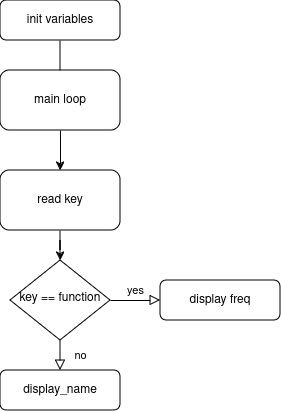

批次/序号： 
<center style="font-size:25px; margin-bottom:10pt; margin-top:10">桂林电子科技大学 电子工程与自动化学院</center>
<center style="font-size:20px">智能仪器实验 预习报告</center>
<table style="margin-top:20pt; margin-bottom:8pt; width:486.2pt; margin-bottom:0pt; border-collapse:collapse">
				<tr style="height:27.4pt">
					<td rowspan="2" style="width:65.35pt; padding-left:4.25pt; vertical-align:bottom">
						<p style="text-indent:0pt; line-height:60%; font-size:12pt">
							<span style="font-family:宋体">实验名称：</span>
						</p>
					</td>
					<td rowspan="2" style="width:86.9pt; border-bottom:0.75pt solid #000000; padding-left:4.25pt; vertical-align:bottom">
						<p style="text-indent:0pt; text-align:center; line-height:60%; font-size:9pt">
							<span style="font-family:宋体">&#xa0;</span>
						</p>
					</td>
					<td rowspan="2" style="width:42.1pt; padding-left:4.25pt; vertical-align:bottom">
						<p style="text-indent:0pt; line-height:60%; font-size:12pt">
							<span style="font-family:宋体">专业：</span>
						</p>
					</td>
					<td rowspan="2" style="width:98.85pt; border-bottom:0.75pt solid #000000; padding-left:4.25pt; vertical-align:bottom">
						<p style="text-indent:0pt; text-align:center; line-height:60%; font-size:12pt">
							<span style="font-family:宋体">&#xa0</span>
						</p>
					</td>
					<td rowspan="2" style="width:7.38pt; border-right:0.75pt solid #000000; padding-left:4.25pt; vertical-align:bottom">
						<p style="text-indent:21pt; line-height:60%; font-size:12pt">
							<span style="font-family:宋体">&#xa0;</span>
						</p>
					</td>
					<td colspan="3" style="width:179.75pt; border-left:0.75pt solid #000000; padding-left:3.88pt; vertical-align:bottom">
						<p style="text-indent:0pt; text-align:left; line-height:60%; font-size:12pt">
							<span style="font-family:宋体">教师评阅意见：</span>
						</p>
					</td>
				</tr>
				<tr >
					<td colspan="3" rowspan="3" style="width:179.75pt; border-left:0.75pt solid #000000; padding-left:3.88pt; vertical-align:top">
						<p style="text-indent:0pt; line-height:40%; font-size:10pt">
							<span style="font-family:宋体">&#xa0;</span>
						</p>
					</td>
				</tr>
				<tr style="height:1pt">
					<td style="width:55.35pt; padding-left:4.25pt; vertical-align:bottom">
						<p style="text-indent:0pt; line-height:60%; font-size:12pt">
							<span style="font-family:宋体">学</span><span style="font-family:宋体">&#xa0;&#xa0;&#xa0; </span><span style="font-family:宋体">号：</span>
						</p>
					</td>
					<td style="width:86.9pt; border-top:0.75pt solid #000000; border-bottom:0.75pt solid #000000; padding-left:4.25pt; vertical-align:bottom">
						<p style="text-indent:0pt; text-align:center; line-height:60%; font-size:12pt">
							<span style="font-family:宋体">&#xa0;</span>
						</p>
					</td>
					<td style="width:42.1pt; padding-left:4.25pt; vertical-align:bottom">
						<p style="text-indent:0pt; line-height:60%; font-size:12pt">
							<span style="font-family:宋体">姓名：</span>
						</p>
					</td>
					<td style="width:98.85pt; border-top:0.75pt solid #000000; border-bottom:0.75pt solid #000000; padding-left:4.25pt; vertical-align:bottom">
						<p style="text-indent:0pt; text-align:center; line-height:60%; font-size:12pt">
							<span style="font-family:宋体">&#xa0;</span>
						</p>
					</td>
					<td style="width:7.38pt; border-right:0.75pt solid #000000; padding-left:4.25pt; vertical-align:top">
						<p style="text-indent:21pt; line-height:60%; font-size:12pt">
							<span style="font-family:宋体">&#xa0;</span>
						</p>
					</td>
				</tr>
				<tr style="height:1pt">
					<td rowspan="2" style="width:65.35pt; padding-left:4.25pt; vertical-align:bottom">
						<p style="text-indent:0pt; line-height:60%; font-size:12pt">
							<span style="font-family:宋体">实验日期：</span>
						</p>
					</td>
					<td rowspan="2" style="width:86.9pt; border-top:0.75pt solid #000000; border-bottom:0.75pt solid #000000; padding-left:4.25pt; vertical-align:bottom">
						<p style="text-indent:0pt; text-align:center; line-height:60%; font-size:12pt">
							<span style="font-family:'Times New Roman'">&#xa0</span>
						</p>
					</td>
					<td colspan="2" rowspan="2" style="width:135.2pt; padding-left:4.25pt; vertical-align:bottom">
						<p style="text-indent:0pt; text-align:left; line-height:60%; font-size:12pt">
							<span style="font-family:宋体">格式规范性得分：</span>
						</p>
					</td>
					<td rowspan="2" style="width:7.38pt; border-right:0.75pt solid #000000; padding-left:4.25pt; vertical-align:top">
						<p style="text-indent:21pt; line-height:60%; font-size:12pt">
							<span style="font-family:宋体">&#xa0;</span>
						</p>
					</td>
				</tr>
				<tr style="height:18.45pt">
					<td style="width:41.5pt; border-left:0.75pt solid #000000; padding-left:3.88pt; vertical-align:bottom">
						<p style="text-indent:0pt; text-align:left; line-height:60%; font-size:12pt">
							<span style="font-family:宋体">成绩：</span>
						</p>
					</td>
					<td style="width:33pt; padding-left:4.25pt; vertical-align:bottom">
						<p style="text-indent:0pt; text-align:center; line-height:60%; font-size:12pt">
							<span style="font-family:宋体">&#xa0;</span>
						</p>
					</td>
					<td style="width:106.75pt; padding-left:4.25pt; vertical-align:bottom">
						<p style="text-indent:0pt; text-align:left; line-height:60%; font-size:12pt">
							<span style="font-family:宋体">教师签名：</span>
						</p>
					</td>
				</tr>
				<!-- <tr style="height:0pt">
 -->
				<!-- 	<td style="width:59.6pt">
 -->
				<!-- 	</td>
 -->
				<!-- 	<td style="width:91.15pt">
 -->
				<!-- 	</td>
 -->
				<!-- 	<td style="width:36.35pt">
 -->
				<!-- 	</td>
 -->
				<!-- 	<td style="width:103.1pt">
 -->
				<!-- 	</td>
 -->
				<!-- 	<td style="width:12pt">
 -->
				<!-- 	</td>
 -->
				<!-- 	<td style="width:35.75pt">
 -->
				<!-- 	</td>
 -->
				<!-- 	<td style="width:37.25pt">
 -->
				<!-- 	</td>
 -->
				<!-- 	<td style="width:111pt">
 -->
				<!-- 	</td>
 -->
				<!-- </tr>
 -->
</table>

# 一、实验原理理解和任务分析（20分，得分： ）

1. 如何使用循环扫描按键
2. 如何通过行列值查找按键的数码表
3. 如何使用使用c语言实现液晶显示
4. 如何存储按键的值并进行运行逻辑切换
5. 如何使用计时中断测量时间
6. 如何使用定时器中断测量频率

# 二、设计思路介绍（25分，得分： ）


1. 使用main初始化界面显示hello
2. 使用switch case 切换功能
3. 使用循环加delay函数实现循环显示
4. 使用函数实现read key和display key实现读取和显示的解耦
5. 使用while循环实现key的循环扫描
6. 使用定时器中断和计数器中断测量频率


# 三、程序流程图介绍（25分，得分： ）
<center>



</center>

# 四、主程序介绍（20分，得分： ）

main function 计算总线地址并启动主循环开始扫描按键并显示
```c
void main(void)
{
	uchar key_pos = 0;
	uchar Code [] = {0x1c,0x1d,0x1e,0x00,0x01,0x02,0x03};
	uchar index;

	//LCD初始化
	Init();
	Clear();

	//display name
	for(index = 0; index < 2; index++)
	{
		Page_ = 0x03;
		Column = (0x00+index)<<4 + 5;
		Code_ = Code[index];
		WriteCHN16x16(Page_,Column,Code_);
	}
	while(read_key() == 0xff);
	Clear();
	
	while(1)
	{
		key_pos = read_key();
		if(key_pos != 0xff)
			precess_keyfn(KEY_NUMBER[key_pos]);
		
	}
	
}
```

read_key funtion 控制74h374循环输出0并读取键，如果读到了键将行放在高8位列放在低8位

```c
// sacnning keys from 0xX000 to 0xX008
unsigned char read_key(void)
{
	unsigned char scan_data = 0x20;//列扫描用IO输出数据
	unsigned char row = 0, col = 0;
	unsigned char key_pos = 0xff;
	//检测是否有按键按下
	XBYTE[ADDR_KEY_WRITE] = 0x00;
	if((XBYTE[ADDR_KEY_READ] & 0x0f) != 0x0f)//有按键按下
	{
		//按键消抖
		Delay5ms();
		
		//进行列检测
		XBYTE[ADDR_KEY_WRITE] = scan_data;
		while((XBYTE[ADDR_KEY_READ] & 0x0f) != 0x0f)//检测到0x0f时即找到该列
		{
			col ++;
			scan_data  = scan_data >> 1;
			XBYTE[ADDR_KEY_WRITE] = scan_data;
		}
		
		//进行行检测
		XBYTE[ADDR_KEY_WRITE] = 0x00;
		switch(XBYTE[ADDR_KEY_READ] & 0x0f)
		{
			case 0x07:row = 0;break;
			case 0x0b:row = 1;break;
			case 0x0d:row = 2;break;
			case 0x0e:row = 3;break;
			default:return 0xff;
			
		}
		//合成按键位置
		key_pos = row*6 + col;
		while((XBYTE[ADDR_KEY_READ] & 0x0f) != 0x0f);
		return key_pos;
	}
	else
		return 0xff;
}
```

display_bus function 控制液晶输出key

```c
// 中文显示子程序
void WriteCHN16x16()
{
  unsigned char i,j,k;

  i = 0;
  j = 0;
  while(j<2) {
    Command = ((Page_ + j) & 0x03) | 0xb8;   // 设置页地址
    WriteCommandE1();
    WriteCommandE2();
    k = Column;                   // 列地址值
    while(k < Column + 16){
      if (k < PD1) {              // 为左半屏显示区域(E1)
        Command = k;
        WriteCommandE1();         // 设置列地址值
        LCDData = CCTAB[Code_][i]; // 取汉字字模数据
        WriteDataE1();            // 写字模数据
      } else{                     // 为右半屏显示区域(E2)
        Command = k-PD1;
        WriteCommandE2();         // 设置列地址值
        LCDData = CCTAB[Code_][i]; // 取汉字字模数据
        WriteDataE2();            // 写字模数据
      };

      i++;
      if( ++k >= PD1 * 2) break;  // 列地址是否超出显示范围
    } ;
    j++;
  };
}

//英文显示子程序
void WriteEN8x8(void)
{
	  unsigned char i,j,k;

		i = 0;
		j = 0;
	
		Command = ((Page_ + j) & 0x03) | 0xb8;   // 设置页地址
    WriteCommandE1();
    WriteCommandE2();
    k = Column;                   // 列地址值

      if (k < PD1) {              // 为左半屏显示区域(E1)
        Command = k;
        WriteCommandE1();         // 设置列地址值
        LCDData = CCTAB[Code_][i]; // 取汉字字模数据
        WriteDataE1();            // 写字模数据
      } else{                     // 为右半屏显示区域(E2)
        Command = k-PD1;
        WriteCommandE2();         // 设置列地址值
        LCDData = CCTAB[Code_][i]; // 取汉字字模数据
        WriteDataE2();            // 写字模数据
      };

      i++;
//      if( ++k >= PD1 * 2)  // 列地址是否超出显示范围
	
}```

定时器中断和计数器中断测量频率

```c
void Init_Timer0(void) {
	TMOD |= 0x01 | 0x00;      //使用模式1，定时器
	TH0=(15536-period)>>4;          	//给定初值
	TL0=(15536-period)&0x00ff;         
	EA=1;            //总中断打开
	ET0=1;           //定时器中断打开
	TR0=1;           //定时器开关打开
}

void Init_Timer1(void) {
	TMOD |= 0x10 | 0x40;      //使用模式1，16位计数器
	TH1=0x00;          //给定初值
	TL1=0x00;         
	EA=1;            //总中断打开
	ET1=1;           //定时器中断打开
	TR1=1;           //定时器开关打开
}

void time0_interrupt() interrupt 1 {
	freq = ((TH1<<4)|TL1)/period;
	//给定初值
	TH0=(15536-period)>>4;          	
	TL0=(15536-period)&0x00ff; 
	//给定初值
	TH1=0x00;
	TL1=0x00;   
}

void time1_interrrupt() interrupt 3{
	// signal_count += 1;
}
```


